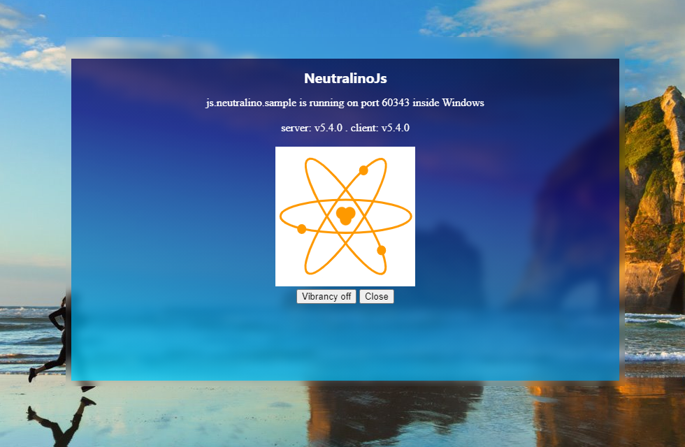

# neutralinojs-ext-vibrancy

With the 5.3.0 release of [neutralinojs](https://neutralino.js.org/), an application can have a transparent background on Windows. This extension for neutralinojs let's you blur the background behind the application, thus giving your window a 'vibrant' look.

The extension is designed to work with Win 7, Win 10 and Win 11. Unfortunately neutralinojs' transparent mode fails on Win 7 as it simply makes the complete window invisible. So for this to work, you either need Win 10 or Win 11.

### Build

The project is separated into two different folders:
- /app	- A barebones neutralinojs template, showcasing the usage of the extension
- /src	- The C++ sourcecode

Start by cloning the repository:

`git clone https://github.com/scanline/neutralinojs-ext-vibrancy`

Get into the **app** directory and use the neu CLI to download it's binaries:
```batchfile
cd app
neu update
```
Now we need to compile the C++ source. This needs a working C++ build environment (MSVC, MinGW) and for making things easier CMake.
```batchfile
cd ../src
cmake -S . -B build
cmake --build build --config Release
```
This will build the extension to **app/extensions/extVibrancy/bin.exe**.

If you're a purist and prefer invoking the compiler directly, you can do so too of course.

For example using MinGW's g++ compiler:
```batchfile
md obj
md ..\app\extensions\extVibrancy
g++.exe -std=c++11 -D_WEBSOCKETPP_CPP11_STL_ -DASIO_STANDALONE -D_WEBSOCKETPP_CPP11_THREAD_ -Os -I.\lib\ -c main.cpp -o obj\main.o
g++.exe -o ..\app\extensions\extVibrancy\bin.exe obj\main.o -s -static -lws2_32
```

Of course you can also get the compiled binary from [Releases](https://github.com/scanline/neutralinojs-ext-vibrancy/releases).

Now go back to the application and start it:
```batchfile
cd ../app
neu run
```
<kbd>  </kbd>

<kbd>  </kbd>

### Usage

Usage is quite simple. Activate:

```javascript
Neutralino.extensions.dispatch("extVibrancy", "vibrancy", {
	activate: true,
	pid: NL_PID
});
```

Deactivate:

```javascript
Neutralino.extensions.dispatch("extVibrancy", "vibrancy", {
	activate: false,
	pid: NL_PID
});
```
